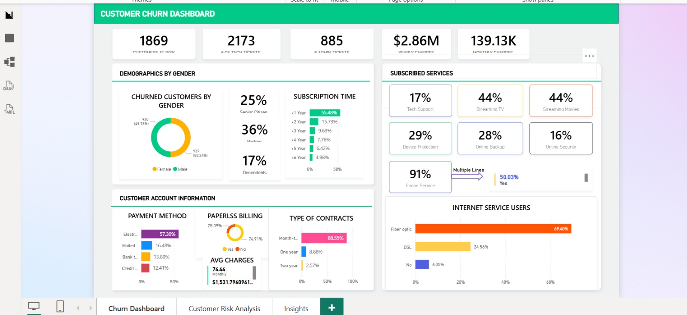
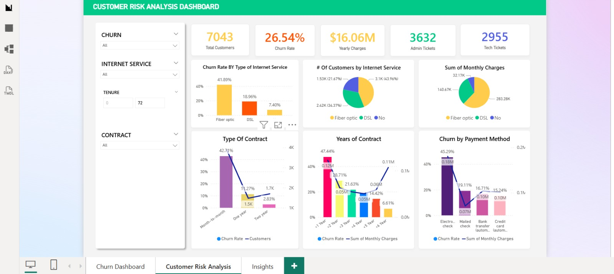
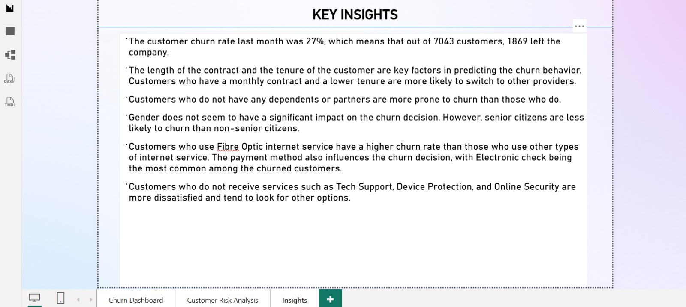

# 📊 Customer Churn Analytics & Retention Engine

[](https://www.python.org/)
[](https://xgboost.readthedocs.io/)
[](https://powerbi.microsoft.com/)
[](https://opensource.org/licenses/MIT)

## 🎯 Project Overview
This end-to-end Data Science project focuses on predicting customer churn for a telecommunications company and, more importantly, building an **Automated Retention Engine**. By leveraging **XGBoost** and **SHAP** (Shapley Additive Explanations), the system identifies high-risk customers and assigns specific business actions to mitigate a potential **$220k+ monthly revenue loss**.

### 🚀 Business Impact (Key Metrics)
*   **Model Performance:** 78.25% Accuracy (Optimized for **Recall** to minimize false negatives).
*   **Revenue at Risk:** Identified ~$167,789 in the "Critical Risk" segment alone.
*   **Key Churn Driver:** New customers and Fiber Optic users are **3x more likely** to churn.
*   **Actionable Intelligence:** Automated segmentation of 7,000+ customers into 4 actionable risk tiers.

---

## 🖥️ Interactive Dashboards
The project includes a comprehensive Power BI suite providing a 360-degree view of customer health and churn metrics.

### 1. Executive Summary & Churn Overview
*Focuses on high-level KPIs, churn rates by contract type, and revenue impact.*


### 2. Customer Segment Analysis
*Deep dive into demographics, tenure groups, and service usage patterns.*


### 3. Risk Prediction & Retention Strategy
*Visualizes the distribution of risk tiers and the potential revenue recovery from suggested actions.*


---

## 🛠️ Tech Stack & Skills
*   **Data Processing:** Python (Pandas, NumPy), SQL (Feature Extraction).
*   **Machine Learning:** XGBoost, Scikit-Learn (Logistic Regression, Random Forest).
*   **Explainable AI:** SHAP (Identifying individual churn drivers).
*   **Data Visualization:** Power BI, Seaborn, Matplotlib.
*   **ETL & Automation:** Automated data pipeline and retention logic.

---

## 🧠 Model Explainability (SHAP)
We move beyond "Black Box" predictions by using SHAP values to explain *why* a customer is likely to leave:
*   **Churn Drivers:** Month-to-month contracts and Fiber Optic services are the strongest predictors of churn.
*   **Loyalty Drivers:** Two-year contracts and long tenure (loyalty) significantly reduce churn probability.

---

## 📉 Retention Strategy (The "Engine")
The retention engine converts model probabilities into prioritized business actions:

| Risk Segment | Criteria (Health Score) | Recommended Business Action |
| :--- | :--- | :--- |
| **🚨 Critical Risk** | < 40 | Direct Assignment to Relationship Manager |
| **⚠️ High Risk** | 40 - 60 | Send Personalized 20% Discount Offer |
| **📈 Medium Risk** | 60 - 80 | Enroll in Targeted Engagement Campaign |
| **✅ Low Risk** | > 80 | Standard Loyalty Maintenance |

---

## 📂 Repository Structure
```bash
├── data/               # Raw and Processed datasets
├── notebooks/          # Step-by-step Jupyter Notebooks (EDA to Modeling)
├── models/             # Serialized XGBoost model and Scalers
├── scripts/            # Production-ready Retention Engine scripts
├── images/             # Dashboard screenshots and SHAP plots
└── reports/            # Exported High-Risk customer lists for CRM
```

---

## ⚙️ Quick Start
1.  **Clone the repository:**
    ```bash
    git clone https://github.com/tayade-aniket/customer-churn-analytics.git
    ```
2.  **Install dependencies:**
    ```bash
    pip install -r requirements.txt
    ```
---

## 👤 Author
**Aniket Tayade**
*   **Portfolio:** [aniket-tayade-nine.vercel.app](https://aniket-tayade-nine.vercel.app/)
*   **LinkedIn:** [linkedin.com/in/aniket-g-tayade](https://www.linkedin.com/in/aniket-g-tayade/)
*   **GitHub:** [github.com/tayade-aniket](https://github.com/tayade-aniket/)

---
*If you found this project insightful, please give it a ⭐!*
